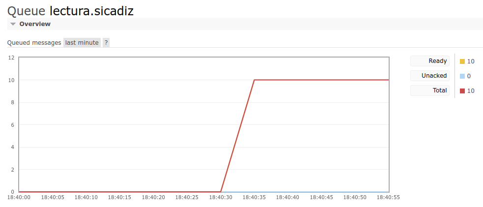

# _Scripts_ para exportar/importar mensajes de colas de **RabbitMQ**

¿Qué pasa cuando queremos probar un servicio o un demonio que consume colas de [RabbitMQ](https://www.rabbitmq.com/)? ¿De dónde sacamos los mensajes? Del mismo sitio que lo haría el demonio en producción: los trincaremos del entorno de producción.

En verdad, en verdad os digo que esto no es más que una capa que _dockerifica_ este estupendo pograma: [rabbitmq-dump-queue](https://github.com/dubek/rabbitmq-dump-queue)

¯\\\_(ツ)_/¯

Si en la instalación donde se encuentra el RabbitMQ de producción no tenemos posibilidad de montar _Docker_, aún podremos usar el binario de `rabbitmq-dump-queue` a pelo, aunque, _EMHO_, es más fácil a día de hoy tener instalado _Docker_ que _Go_.

## Dependencias de aquí y de allá ♻

Para poder utilizar esta vaina necesitamos tener instalado todo esto:

* [Docker](https://www.docker.com/), en remoto y en local.
* [Python](https://www.python.org/), [pip](https://pypi.org/project/pip/) y [pika](https://pypi.org/project/pika/), todos ellos en local.

La parte más desconocida de la instalación es la de las dependencias de _Python_; en sistemas `Debian GNU/Linux` y derivados será algo así, suponiendo que ya tenemos _Python_:

```bash
❯ apt install python3-pip
```

```bash
❯ pip install --user pika
Collecting pika
  Downloading pika-1.3.0-py3-none-any.whl (155 kB)
     ━━━━━━━━━━━━━━━━━━━━━━━━━━━━━━━━━━━━━━━━ 155.3/155.3 KB 1.9 MB/s eta 0:00:00
Installing collected packages: pika
Successfully installed pika-1.3.0
```

## ¿Cómo carallo funciona esto? 🔧

### Un plan sin fisuras

1. En el sistema remoto construiremos la imagen de _Docker_ para el contenedor en el que empotraremos ─con perdón─ el programa `rabbitmq-dump-queue`; para ello tenemos un _Dockerfile_ pequeño, pero matón.

2. A la hora de exportar los mensajes, dependeremos del escenario en el que nos encontremos: si es algo esporádico, rápido y sucio, podremos tirar directamente de la línea de comandos, y no complicarnos; si es una operación que probablemente repetiremos, o no sabemos si repetiremos, pero nos interesa dejar cierta configuración preparada para que la vez siguiente sea más sencillo todo, podremos hacerlo gracias a la plantilla de configuraciones de los _scripts_ de _bash_ (_config.sh.dist_).

3. Ya en nuestra máquina, contaremos con un _script_ de _bash_ para arrancar un contenedor de _RabbitMQ_ en el que cargar los mensajes exportados en el paso anterior. Como es evidente, se da por supuesto que en local también tenemos _Docker_ instalado.

4. A la hora de importar los mensajes, dependeremos de su propia naturaleza: tendremos, o bien ficheros de texto plano, como [JSON](https://www.json.org/json-en.html), o bien ficheros binarios, como [protobuf](https://developers.google.com/protocol-buffers). Cada tipo cuenta con un _script_ de _Python_ adecuado que lleva a cabo la importación.

5. En último lugar, por si el consumo de mensajes es desaforado y nuestros desarrollos o pruebas no han finalizado, podremos eliminar la cola y repetir la importación.

### Creando la imagen del contenedor de exportación

Sin trampa ni cartón, con `docker build`:

```bash
docker build -t rabbitmq-queue-export .
```

Veremos una salida parecida a la siguiente:

```bash
Sending build context to Docker daemon  294.2MB
Step 1/4 : FROM golang:latest
latest: Pulling from library/golang
001c52e26ad5: Pull complete 
d9d4b9b6e964: Pull complete 
2068746827ec: Pull complete 
9daef329d350: Pull complete 
1c28274a8e7c: Pull complete 
39a7c004eb58: Pull complete 
a98825e7f2fd: Pull complete 
Digest: sha256:1860373709cc04bacfcf3bb1aaa8c14bb1243e971e9c4e70607ffa05f72466d6
Status: Downloaded newer image for golang:latest
 ---> da8d5a6f7a03
Step 2/4 : VOLUME ["/rabbit"]
 ---> Running in fe6340030f5c
Removing intermediate container fe6340030f5c
 ---> 93537b61dd2d
Step 3/4 : RUN go install github.com/dubek/rabbitmq-dump-queue@latest
 ---> Running in 27cacb784b4d
go: downloading github.com/dubek/rabbitmq-dump-queue v0.0.0-20211227121632-83516016431a
go: downloading github.com/rabbitmq/amqp091-go v1.2.0
Removing intermediate container 27cacb784b4d
 ---> 54d133ef9b41
Step 4/4 : ENTRYPOINT ["/bin/bash"]
 ---> Running in b0e7892ba858
Removing intermediate container b0e7892ba858
 ---> 2dc44d1b88de
Successfully built 2dc44d1b88de
Successfully tagged rabbitmq-queue-export:latest
```

Y tendremos nuestra imagen `rabbitmq-queue-export` preparada:

```bash
❯ docker images
REPOSITORY              TAG       IMAGE ID       CREATED         SIZE
rabbitmq-queue-export   latest    a606099d196b   2 minutes ago   1GB
golang                  latest    da8d5a6f7a03   2 weeks ago     992MB

```

Creamos a continuación el contenedor, para lo que ya tenemos un _script_ propio de _bash_:

```bash
./run-rabbitmq-dump-queue
Error: No such container: rabbitmq-queue-export-1
root@51d293107129:/go#
```

Dos detalles importantes ahí arriba:

* `Error: No such container: blablabla` → Significa que se ha intentado eliminar un contenedor previo con dicho nombre, y no ha sido posible. No pasa nada.
* `root@51d293107129:/go#` → Que nadie se asuste: hemos abierto una sesión de _bash_ en el contenedor (el _script_ hace un `docker run -it ...`).

El volumen lo hemos montado en `/rabbit`, así que ahí están nuestros _scripts_, sus ficheros de configuración, y el directorio donde almacenaremos los mensajes exportados:

```bash
root@1db4035dbb52:/go# ls /rabbit/
Dockerfile  __pycache__                  build-local-queue.py  config.py.dist  config.sh.dist  export-rabbitmq-queue  rabbit.py              run-local-rabbitmq
README.md   build-local-binary-queue.py  config.py             config.sh       data            local-rabbitmq-mnesia  remove-local-queue.py  run-rabbitmq-dump-queue
```

### Exportando mensajes del RabbitMQ remoto

Con el programa `rabbitmq-dump-queue` extraeremos los mensajes que necesitamos de la cola en la que están. Por su indudable interés, es recomendable echar un vistazo a dichas opciones de exportación, que pueden encontrarse en el [README](https://github.com/dubek/rabbitmq-dump-queue#readme) de su repo.

Como comentábamos hace unos párrafos, tenemos dos opciones:

* Completamos toda la información necesaria en la misma línea de comandos a la hora de invocar al programa:

```bash
rabbitmq-dump-queue \
  -uri="amqp://<USER_NAME>:<USER_PASSWD>@<RABBIT_HOST>:<RABBIT_PORT>/" \
  -queue=<queue_name> \
  -max-messages=<MAX_MESSAGES> \
  -output-dir=<DATA_PATH>
```

* Por comodidad si la situación lo requiere, ejecutamos el _script_ de _bash_ de exportación `export-rabbitmq-queue`, habiendo creado el fichero de configuración previamente:

```bash
cp config.sh.dist config.sh
vim config.sh ← aquí introducimos los valores correspondientes al RabbitMQ de PRO
```

Ojo: Las opciones de exportación empleadas en este _script_ son las que aparecen en la invocación directa del programa. Si necesitáramos algo más fino, o emplear alguna opción curiosa de las que tiene `rabbitmq-dump-queue`, el _script_ no nos sirve tal y como está.

En cualquier caso, seremos testigos de la exportación; cuando termine, podremos comprobar el resultado y cerrar el contenedor _(Ctrl+d)_:

```bash
root@1db4035dbb52:/rabbit# ./export-rabbitmq-queue 
/rabbit/data/msg-0000
/rabbit/data/msg-0001
/rabbit/data/msg-0002
/rabbit/data/msg-0003
/rabbit/data/msg-0004
/rabbit/data/msg-0005
/rabbit/data/msg-0006
/rabbit/data/msg-0007
/rabbit/data/msg-0008
/rabbit/data/msg-0009
root@1db4035dbb52:/rabbit# ls -ltr data/
-rw-r--r-- 1 1000 1000     79 Aug 19 16:04 msg-0000
-rw-r--r-- 1 1000 1000 252821 Aug 19 16:04 msg-0008
-rw-r--r-- 1 1000 1000     80 Aug 19 16:04 msg-0007
-rw-r--r-- 1 1000 1000     79 Aug 19 16:04 msg-0006
-rw-r--r-- 1 1000 1000 304575 Aug 19 16:04 msg-0005
-rw-r--r-- 1 1000 1000     79 Aug 19 16:04 msg-0004
-rw-r--r-- 1 1000 1000 509416 Aug 19 16:04 msg-0003
-rw-r--r-- 1 1000 1000     79 Aug 19 16:04 msg-0002
-rw-r--r-- 1 1000 1000 324546 Aug 19 16:04 msg-0001
-rw-r--r-- 1 1000 1000 292596 Aug 19 16:04 msg-0009
root@1db4035dbb52:/rabbit# 
exit

```

En este punto podremos comprimir el directorio de salida completo ─si no lo hemos hecho ya automágicamente porque hemos leído el _README_ del programa─, y transferir el fichero a nuestra máquina por el medio que más nos convenza.

### Levantando un RabbitMQ local

Ahora que tenemos los mensajes, montaremos nuestro _RabbitMQ_ local para importarlos:

```bash
./run-local-rabbitmq
94111048d29afe0fc942e83413c6d2b0637d28dc95f7c1d55b5f1a32ae4d92b3
```

```bash
docker ps
CONTAINER ID   IMAGE                       COMMAND                  CREATED          STATUS          PORTS                                                                                                                                                 NAMES
94111048d29a   rabbitmq:3-management       "docker-entrypoint.s…"   30 seconds ago   Up 29 seconds   4369/tcp, 5671/tcp, 0.0.0.0:5672->5672/tcp, :::5672->5672/tcp, 15671/tcp, 15691-15692/tcp, 25672/tcp, 0.0.0.0:15672->15672/tcp, :::15672->15672/tcp   local-rabbitmq
```

La imagen para _RabbitMQ_ incluye el _plug-in_ `management`, así que si abrimos nuestro navegador web favorito podremos, por ejemplo, cargar la configuración del nodo original, o verificar el proceso de importación de los mensajes: `http://localhost:15672/`

### Importando los mensajes en el RabbitMQ local

Como anunciábamos hace un rato, dependiendo de la naturaleza de los mensajes tenemos dos _scripts_ de _Python_:

* Si los mensajes son texto plano, por ejemplo, _JSON_.

```bash
./build-local-queue.py
```

* Si los mensajes son binarios, por ejemplo, _protobuf_.

```bash
./build-local-binary-queue.py
```

Ambos _scripts_ utilizan una clase común para las operaciones de conexión, desconexión, envío y tal, definida en _rabbit.py_, y un mismo fichero de configuración, que se debe construir a partir de la plantilla _config.py.dist_

Si no sabemos de qué están hechos nuestros mensajes, que todo puede ocurrir, lo descubriremos al ejecutar el _script_ incorrecto.

Verbigracia:

```bash
./build-local-queue.py
 [ ] Sending binary message msg-0006
Error sending data :(
'utf-8' codec can't decode byte 0x87 in position 25: invalid start byte

```

Pero:

```bash
./build-local-binary-queue.py
 Sending binary message msg-0006
 [x] Sent data to RabbitMQ
 Sending binary message msg-0001
 [x] Sent data to RabbitMQ
 Sending binary message msg-0003
 [x] Sent data to RabbitMQ
 Sending binary message msg-0009
 [x] Sent data to RabbitMQ
 Sending binary message msg-0008
 [x] Sent data to RabbitMQ
 Sending binary message msg-0000
 [x] Sent data to RabbitMQ
 Sending binary message msg-0005
 [x] Sent data to RabbitMQ
 Sending binary message msg-0004
 [x] Sent data to RabbitMQ
 Sending binary message msg-0007
 [x] Sent data to RabbitMQ
 Sending binary message msg-0002
 [x] Sent data to RabbitMQ
 All binary data sent

```

Y, claro:



### Eliminando la cola para volver a empezar

Existe un último _script_ de _Python_ que nos permite eliminar la cola de nuestro _RabbitMQ_ local para repetir la operación de importación, si fuera necesario:

```bash
./remove-local-queue.py
 [x] Queue <QUEUE_NAME> terminated
```

Este _script_ utiliza el nombre de la cola definido en _config.py_, aunque también admite un argumento, (¡Oh, sorpresa) el nombre de la cola:

```bash
./remove-local-queue.py <QUEUE_NAME>
 [x] Queue <QUEUE_NAME> terminated
```

## ¿Qué se puede mejorar? 📑

* _Dockerificar_ también _Python_ y sus dependencias.
